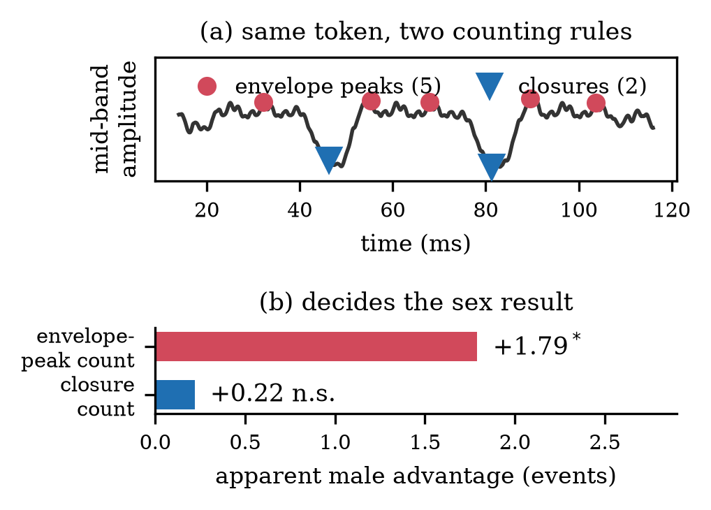

# trillscope

**Closure-based detection and multi-corpus acoustic analysis of the Spanish trill /r/.**

This repository contains the code behind the paper *Spanish Trill Production: A
Multi-Corpus Acoustic Study* (IberSpeech 2026; see [Citation](#citation)). It provides:

- a **closure detector** that counts the lingual closures of a trill (band-limited
  energy minima followed by a verified release burst) instead of envelope peaks;
- an **independent period-based estimator** used as an internal consistency check;
- a **multi-corpus pipeline**: ingestion of eight Spanish speech corpora, trill
  candidate extraction, acoustic measurement, a fixed quality filter, validation
  against the descriptive literature, speaker-level statistics, robustness sweeps and
  figures.

## Key findings

<p align="center">
  
</p>

Applied to 3,560 quality-filtered trill tokens from 356 speakers in six Spanish corpora:

- The detector yields a **median of two closures** and an inter-closure period of
  **about 36 ms**, within the ranges reported by the descriptive literature on every
  corpus.
- **Phonotactic context** is the only factor with a robust, medium effect: onset
  trills (word-initial and after /n, l, s/) show more closures than intervocalic *rr*.
- There is **no robust evidence of a sex effect** once closures are counted directly.
  An envelope-peak counter applied to the same audio produces a large apparent male
  advantage (+1.79 events versus +0.22 for closures), because it registers both the
  closure and its release and its count depends on f0.

## Why count closures?

A trill is a short sequence of occlusions and releases. Counters that pick maxima of
the amplitude envelope tend to register each closure *and* its release, and the number
of peaks grows with harmonic density. The descriptive literature (Quilis 1993; Blecua
2001; Henriksen & Willis 2010; Bradley & Willis 2012) counts closures on spectrograms,
so `trillscope` counts the same unit:

1. Band-pass the token into a low band (60–500 Hz, voicing) and a mid band
   (500–3500 Hz, turbulence and release bursts) and compute 2.5 ms RMS envelopes.
2. **Closure candidates** are local minima of the mid-band envelope that fall below
   40 % of the local maximum within a 50 ms window, drop at least 5 dB from it, are at
   least 25 ms apart, and also show a drop of at least 3 dB in the combined
   low × mid envelope (which rejects vowel-boundary artefacts).
3. **Release verification**: each candidate needs a mid-band burst 3–25 ms later that
   reaches 40 % of the local mid-band maximum.
4. **Periodicity refinement**: a closure is dropped when both of its adjacent
   intervals deviate by more than 2 SD from the median interval.
5. Counting is restricted to the aligned segment, analysed with ±20 ms of padding to
   absorb alignment error. Each token also gets a confidence score based on interval
   regularity and closure-depth uniformity.

The parameters used for the paper live in
[`trillscope/config/detector.yaml`](trillscope/config/detector.yaml) and are loaded
with `trillscope.detector.load_config()`.

Before detection, every candidate token passes a detector-agnostic **quality filter**
(`trillscope/quality.py`): duration in [50, 200] ms, voicing ≥ 80 %, and an envelope
periodicity score ≥ 0.40 (autocorrelation peak of the mid-band envelope at lags of
25–55 ms). Each corpus is then checked against literature targets
(`trillscope/validate.py`): median closures in [1, 3], median period in [30, 50] ms, and
≥ 65 % agreement (±1 closure) with the independent period-based estimator.

## Installation

Python ≥ 3.11.

```bash
git clone https://github.com/MateoCamara/trillscope.git
cd trillscope
pip install -e ".[dev]"        # or: uv venv && uv pip install -e ".[dev]"
```

Forced alignment of the corpora without native phone alignments uses the
[Montreal Forced Aligner](https://montreal-forced-aligner.readthedocs.io/), which must be
installed separately (for example with conda).

## Quick start: detect closures in a token

```python
import librosa
from trillscope.detector import detect_closures, detect_n_closures_by_period, load_config

# A short excerpt around one trill, mono, 16 kHz.
audio, sr = librosa.load("perro_rr.wav", sr=16000, mono=True)

# Region of the trill inside the excerpt, in ms (e.g. from a phone alignment).
roi = (20.0, 105.0)

result = detect_closures(audio, sr, cfg=load_config(), roi_ms=roi)
print(result.n_closures)                          # number of closures
print([c.closure_t_ms for c in result.closures])  # closure times (ms)
print(result.confidence)                          # 0-1

# Independent estimate from the envelope period
period = detect_n_closures_by_period(audio, sr, roi_ms=roi)
print(period.n_closures, period.period_ms)
```

`trillscope.synthetic` generates synthetic trills with known closure times, which the
test suite uses as ground truth.

## Reproducing the paper

### Data

**No audio, transcripts or speaker metadata are included.** The corpora are distributed
under their own licences and have to be obtained from their providers:

| Corpus | Alignment | Used in the paper | Expected location under `dataset/` |
|---|---|---|---|
| DIMEx100 (Pineda et al.) | native (`.phn`) | yes | `CorpusDimex100/` |
| ALBAYZIN (ELRA) | native (SEO) | yes | `ALBAYZIN/` |
| Glissando (Garrido et al. 2013) | native (TextGrid) | yes | `03 glissando-sp/` |
| PRESEEA | MFA | yes | `preseea/` |
| TEDx Spanish (OpenSLR 67) | MFA | yes | `tedx_spanish_corpus/` |
| Heroico (LDC2006S37) | MFA | yes | `LDC2006S37/` |
| Common Voice (Mozilla) | MFA | no (excluded by policy) | `cv-corpus-*/es/` |
| M-AILABS | MFA | no (excluded by policy) | `es_ar_female/`, `es_ar_male/`, … |

All commands below are run from the repository root. Intermediate results are written
to `metadata/`, `outputs/` and `reports/`, which are ignored by git.

### 1. Ingestion, metadata and candidate extraction

```bash
python -m trillscope.ingestion.cli ingest all          # -> metadata/<dataset>_raw.parquet
python -m trillscope.metadata.cli normalize all        # -> metadata/metadata_unified.parquet

python -m trillscope.extraction.cli setup-mfa          # download the Spanish MFA models
python -m trillscope.extraction.cli extract all        # DIMEx100, ALBAYZIN, Glissando, PRESEEA (runs MFA)
python -m trillscope.extraction.mfa_extractor all      # TEDx, Heroico, Common Voice, M-AILABS
```

`extract` labels each /r/ by context (intervocalic *rr*, word-initial *r*, *r* after
/n, l, s/) and writes `outputs/tables/r_candidates_<dataset>.parquet`.

> **Note.** Alignment of TEDx, Heroico, Common Voice and M-AILABS is not automated.
> Run MFA yourself and place one TextGrid per utterance, named after its `utt_id`, in
> `mfa_work/<dataset>/output/` before running `mfa_extractor`.

### 2. Acoustic measurement and closure detection

```bash
python -m trillscope.measurement.cli measure all       # voicing, f0, HNR, intensity + envelope-peak baseline
python -m trillscope.build_tokens                      # token table + periodicity score
trillscope detect all                                  # quality filter + closure detector
trillscope cross-validate all                          # independent period-based estimate
trillscope validate all                                # literature checks -> reports/validation/
```

### 3. Statistics, mechanism and robustness analyses

```bash
python -m trillscope.bridge_to_v1_stats                # closure counts in the measurement schema
python -m trillscope.statistics.cli analyze all \
    --measurements-dir outputs/tables_v2 \
    --output-dir outputs/v2/tables --reports-dir reports/v2
python -m trillscope.statistics.bootstrap_cis          # bootstrap CIs for the medians

python -m trillscope.compute_f0_for_tokens             # per-token f0 (pYIN)
python -m trillscope.mechanism_sex                     # envelope-peak over-count vs f0 and sex
python -m trillscope.attrition_sex                     # is the quality filter sex-balanced?
python -m trillscope.context_cross_detector            # context effect with both estimators

python -m trillscope.detect_unfiltered                 # detector on the unfiltered pool
python -m trillscope.sweep_quality                     # quality-filter sensitivity
python -m trillscope.sweep_detector                    # detector-parameter sensitivity
```

### 4. Figures and supplementary website

```bash
python -m trillscope.paper.figures_v2                  # -> outputs/figures/
python -m trillscope.paper.build_supplement            # -> supplement/
```

The supplementary website only embeds synthetic audio and Common Voice (CC0) clips; the
other corpora appear as derived visualisations only.

## Repository layout

```
trillscope/
  detector/       closure detector, period-based estimator, config loading
  config/         detector parameters used in the paper
  ingestion/      one ingestor per corpus -> raw metadata tables
  metadata/       unified speaker metadata (sex, age, education, region)
  extraction/     trill candidate extraction and context labelling (native + MFA)
  measurement/    voicing, f0, HNR, intensity and the envelope-peak baseline
  statistics/     speaker-level tests, effect sizes, bootstrap CIs
  paper/          figures and supplementary website
  quality.py      quality filter
  validate.py     literature-anchored validation reports
  synthetic.py    synthetic trill generator
  cli.py          `trillscope detect | cross-validate | validate`
tests/            synthetic ground-truth tests for both detectors
```

## Tests

```bash
pytest
```

## Citation

If you use this code, please cite:

```bibtex
@misc{trillscope2026,
  title         = {Spanish Trill Production: A Multi-Corpus Acoustic Study},
  author        = {TODO},
  year          = {TODO},
  eprint        = {TODO},
  archivePrefix = {arXiv},
  primaryClass  = {TODO}
}
```

## License

The code is released under the [MIT License](LICENSE). The speech corpora are not part
of this repository and remain subject to their own licences.

## Contact

Mateo Cámara — mateo.camara.largo@alumnos.upm.es
